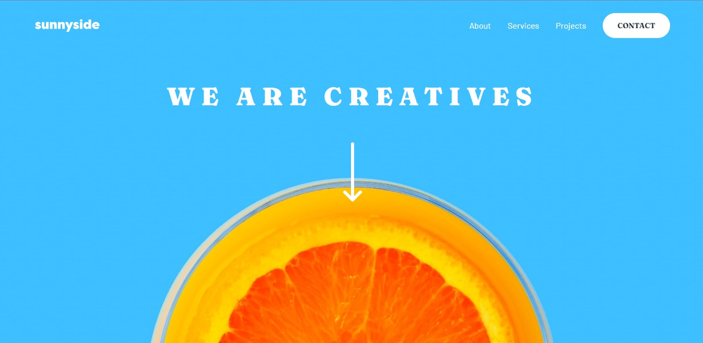

## Table of contents

- [Overview](#overview)
  - [The challenge](#the-challenge)
  - [Screenshot](#screenshot)
  - [Links](#links)
- [My process](#my-process)
  - [Built with](#built-with)
  - [What I learned](#what-i-learned)
  - [Continued development](#continued-development)
- [Author](#author)

## Overview

### The challenge

Users should be able to:

- View the optimal layout for the site depending on their device's screen size
- See hover states for all interactive elements on the page

### Screenshot



### Links

- Solution URL: [https://sunnyside-ten-chi.vercel.app/]
- Live Site URL: [https://sunnyside-ten-chi.vercel.app/]

## My process

### Built with

- Semantic HTML5 markup
- CSS custom properties
- Mobile-first workflow
- [React](https://reactjs.org/) - JS library
- [Tailwind CSS](https://tailwindcss.com/) - For styles

### What I learned

This project was my first frontend mentor's exercises and, even it´s seems simple, I learned a lot by working on it.

I created HTML5 based on React components, with props and jsx format.

The css was a little tricky, because a had to use css code mixed with tailwind css utilities classes, some of them customized by myself and others from the origin framework kit. And then, I needed variables from css which I used in tailwindcss configuration.
One of the most difficult part for me was the detail of the nav menu in mobile design, because I´d never done something like that before. So, I searched how to do it with css, and I decided to implement a css's property: clip-path, and I think it worked.

```css and tailwindcss classes
@layer base {
  :root {
    /* Primary colors */
    --color-primary-soft-red: 7deg 99% 70%;
    --color-primary-yellow: 51deg, 100%, 49%;
    --color-primary-cyan: 167deg, 40%, 24%;
    --color-primary-blue: 198deg, 62%, 26%;
    --color-primary-mcyan: 168deg, 34%, 41%;
    /* Neutral colors */
    --color-neutral-ddblue: 212deg, 27%, 19%;
    --color-neutral-dgblue: 213deg, 9%, 39%;
    --color-neutral-dblue: 232deg, 10%, 55%;
    --color-neutral-blue: 210deg, 4%, 67%;
    --color-neutral-white: 0deg, 0%, 100%;
  }
}

.menu-deco {
  @apply bg-neutral-white w-24 h-12;
  clip-path: polygon(100% 0%, 100% 100%, 50% 100%);
  position: absolute;
  top: 0;
  right: 0;
}
```

### Continued development

In my opinion this project could be better with some other functionalities, because it has only a few interactive elements and a bit of javascript code.

## Author

- Website - [Maximiliano Leonel Pérez](https://maxoleo-dev.vercel.app/)
- Frontend Mentor - [@MaximilianoLeonel23](https://www.frontendmentor.io/profile/MaximilianoLeonel23)
- Linkedin - [Maximiliano Leonel Pérez](https://www.linkedin.com/in/maximiliano-leonel-p%C3%A9rez-8846b826a/)
